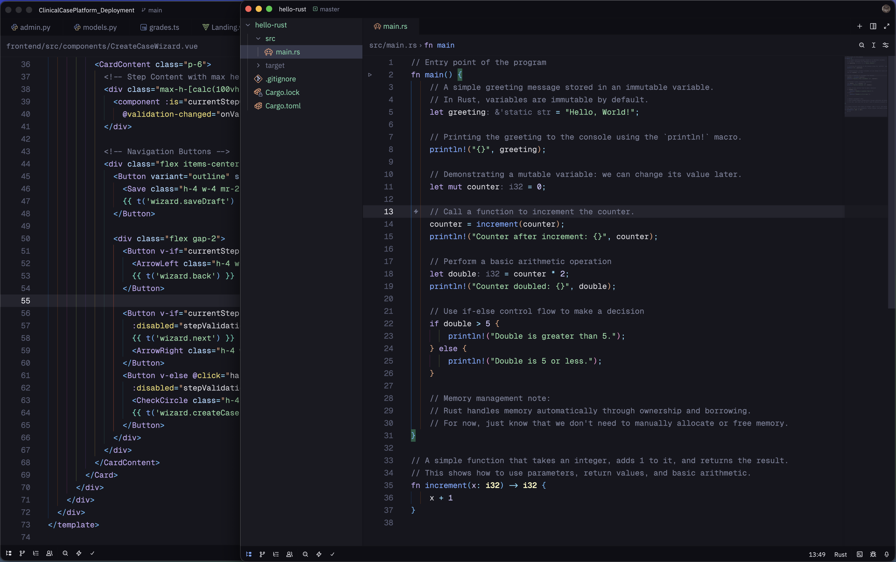
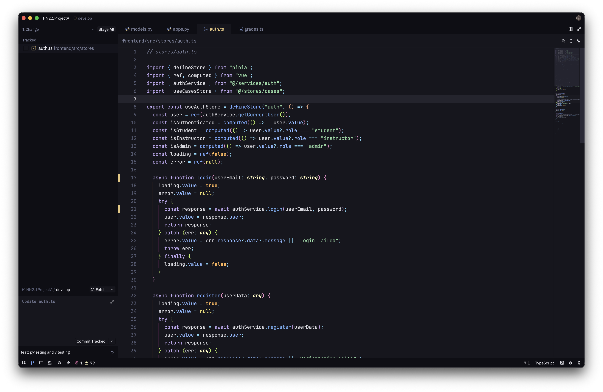

# Kaimandres for Zed

# Kaimandres

**A robust, high-contrast, semantic theme; a crossover between Poimandres and Kanagawa aesthetics.**

 

  
  

**[View Live Preview on Zed-Themes](https://zed-themes.com/themes/-NvUnJul7Bvewn1wS29Ff)**

---

## Philosophy

> Kaimandres is handcrafted for the "deep void," balancing the renowned sleek aesthetics of **Poimandres** with the robust semantic logic and dimming capabilities of **Kanagawa**.

While the original Poimandres offers a sleek minimal aesthetic, Kaimandres introduces a specific tuning of shades to ensure syntax elements pop without causing eye strain, maintaining a balance between **readability** and **aesthetics**.

---

## Features

- **Semantic Depth:** Full utilization of Zed's syntax highlighting features to distinguish variables, keywords, and control flow logic clearly.
- **Enhanced Palette:** Cherry-picked shades that introduce new colors while strictly maintaining the original "soul" of the Poimandres palette.
- **Deep Immersion:** The UI uses `inkBlack` and `voidBlack` tones to blend the editor canvas seamlessly with the sidebars and panels.
- **Focus-Driven:** Italics are used sparingly for keywords and comments to create flow, while bolding is reserved for control flow.

---

## Installation

### Via Zed Extensions (Recommended)

1. Open Zed.
2. Open the **Extensions** view (`Cmd+Shift+X` or via the application menu).
3. Search for `Kaimandres`.
4. Click **Install**.
5. Go to your settings/theme picker with `Cmd+K+T` and select **Kaimandres**.

### Manual Installation (Development)

If you wish to test the theme manually or modify it:

1. Download the `Kaimandres.json` file from: **[Kaimandres on Zed Themes](https://zed-themes.com/themes/-NvUnJul7Bvewn1wS29Ff)** or directly from this Github repository under `themes`.
2. Place it in your Zed configuration directory: `~/.config/zed/themes/`.
3. Go to your settings/theme picker with `Cmd+K+T` and select **Kaimandres**.
4. Restart Zed or reload the window.

---

## Other Ports

This theme is part of a larger ecosystem, all handcrafted by me, ensuring visual consistency across your workflow.

- **Neovim:** [kaimandres.nvim](https://github.com/MartelleV/kaimandres.nvim) — The original implementation with robust TreeSitter and LSP integration.
- **VS Code:** [kaimandres-vscode](https://github.com/MartelleV/kaimandres-vscode) — The official VS Code port, available for direct installation on VS Code Marketplace.

---

## Reporting Issues

If you encounter visual inconsistencies or unexpected behavior while using Kaimandres in Zed, please open an issue.

When reporting an issue, please include:

- A clear description of the problem (e.g., specific language highlighting).
- Screenshots demonstrating the issue.
- Your Zed version and settings.

---

## Acknowledgements

This project has been built based on many inspirations. Special thanks to:

- **[Rebelot](https://github.com/rebelot)** for creating **Kanagawa.nvim** and inspiring the architectural logic.
- **[Poimandres](https://github.com/drcmda/poimandres-theme)** developers for the original VS Code theme and the beautiful color theory.
- **[The iTerm2 Color Scheme Community](https://github.com/mbadolato/iTerm2-Color-Schemes)** for introducing me to this aesthetic.

---

## License

MIT © [MartelleV](https://github.com/MartelleV).
